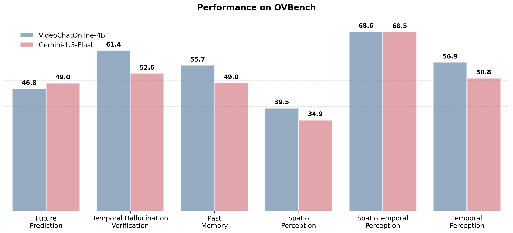
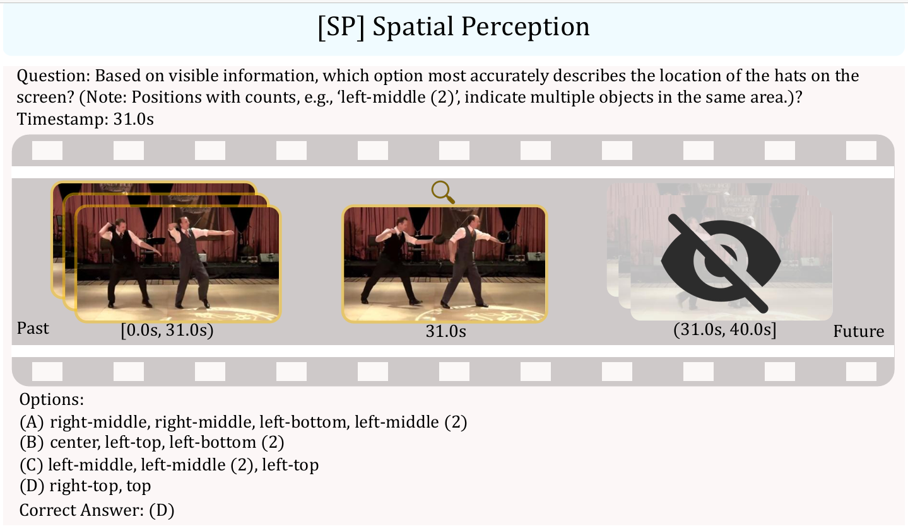
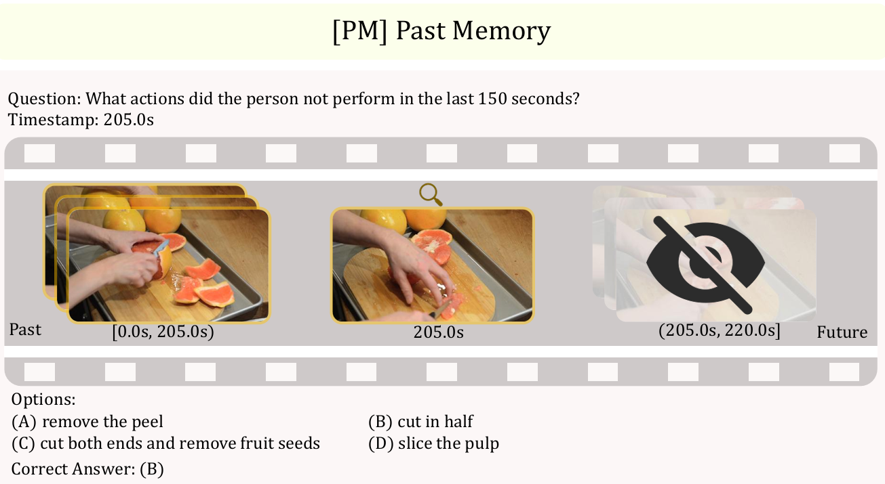

# VideoChat-Online
<div style="text-align: center;">
    <h2 style="display: inline-block; vertical-align: middle; margin-left: 10px; margin-bottom: 0;">
        <a href="https://videochat-online.github.io">[CVPR2025] Online Video Understanding: OVBench and Memory-Augmented Method</a>
    </h2>
</div>

<p align="center">
  <a href="https://arxiv.org/abs/2501.00584"></a>
  <a href="https://huggingface.co/datasets/MCG-NJU/VideoChatOnline-IT"></a>
  <a href="https://huggingface.co/datasets/MCG-NJU/VideoChatOnline"></a>
  <a href="https://videochat-online.github.io/"></a>
  <a href="https://opensource.org/licenses/MIT"></a>
</p>
<p align="center">
    
</p>


# 📝 **Highlights**

🚀 **Introducing OVBench**
 OVBench is a benchmark tailored for **real-time video understanding**:

- **Memory, Perception, and Prediction of Temporal Contexts**: Questions are framed to reference the present state of entities, requiring models to memorize/perceive/predict past/present/future temporal contexts over time.
- **Dynamic Spatio-temporal Interaction**: The benchmark demands precise real-time interactions with video content, where actions, objects, and events must be understood in the context of their spatial and temporal relationships.
- **Contextual Awareness at Specific Moments**: Real-time questions are contextual, changing based on the specific timestamp at which they are asked, requiring a deep understanding of how temporal context evolve over time.

---

🏗️ **Pyramid Memory Bank **  
To tackle the challenges of infinite video streams, we propose a **multi-layered Pyramid Memory Bank** that balances **spatial and temporal information**:  

1. **Spatial Anchors**: The lower layers retain high-resolution features to preserve fine-grained spatial cues, capturing key frames as "spatial anchors" with a lower sampling rate.
2. **Progressive Abstraction**: As the layers progress, spatial resolution decays  while temporal sampling rate grows proportionally , forming an abstract representation of fine-grained long-short-term patterns.
3. **Dynamic Eviction**: A dynamic eviction mechanism detects temporal redundancy via similarity, combined with pooling for spatial compression, improving storage efficiency.

---

🎯 **Offline-to-Online Learning Paradigm**  
A novel training strategy designed for online video streams:  

- **Interleaved Dialogue Tuning**: Combines offline video data with online instruction tuning in a dialogue format.  
- **Progressive Learning**: Bridges offline and online video understanding, enhancing real-time adaptability.  

## To-Do

- [ ] Model checkpoint Upload
- [ ] More comprehensive demo

# 🛠️ Installation
To install the necessary dependencies, use the following commands:

```bash
conda create -n your_env python=3.9
pip install -r requirements.txt
```
# 📦 Offline Data Preparation
The anno_data file provides the paths for different types of datasets:

```json
"coin_sl_train": {
    "annotation": "Path to the annotations json file.",
    "data_root": "your data path",
},
...
```
For specific data json format, we support the data reading formats of `LLaVA` and `VideoChat2-IT`.

# 🔄 [Online SFT Data](https://huggingface.co/datasets/MCG-NJU/VideoChatOnline-IT) Download

For the construction format of online data, please refer to [VideoChatOnline-IT](https://huggingface.co/datasets/MCG-NJU/VideoChatOnline-IT)

# 📈 Evaluations Results
| Benchmark          | Result                                                 |
|--------------------|--------------------------------------------------------|
| **OVBench**        | 54.9                                                   |
| **VideoMME**       | Short: 65.8<br>Medium: 50.2<br>Long: 47.1<br>Avg: 54.4  |
| **MVBench**        | 65.2                                                   |
| **EgoSchema** | 54.7                                                   |
| **MLVU**           | 60.8                                                   |
| **LongVideoBench** | 53.6                                                   |


# 🚀 Training
To run the training, execute the following bash commands for different stages:
```bash
#Offline SFT:
bash shell/online_4b/videochat_online_4b_stage1_ft.sh
```
```bash
#Online & Offline Joint SFT:
bash shell/online_4b/videochat_online_4b_stage2_ft.sh
```
# 🎥 Demo
To launch the demo, use the following script:

```bash
bash gradio_demo.sh
```

# 📊 Evaluation on [OVBench](https://huggingface.co/datasets/MCG-NJU/OVBench)

<div style="text-align: center;">
    <div style="display: inline-block; margin-right: 10px;">
        
    </div>
    <div style="display: inline-block;">
        
    </div>
</div>

```bash
#Sliding Window Setting:
bash shell/eval/online_bench_sliding_window.sh
#Streaming Setting:
bash shell/eval/online_bench_stream.sh
```

